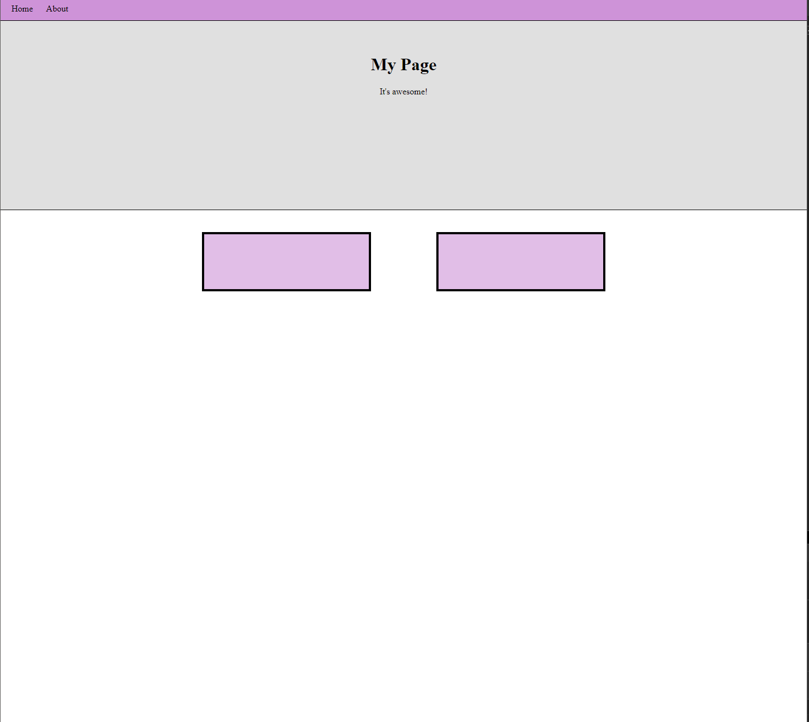

# Introduction To CSS


## Overview

So far we've learned how to set up and structure a HTML file. Now we'll make it look pretty! This an introductory lesson to CSS. We'll touch on very basic topics ranging from positioning to coloring!

## Objectives

- Learn how to link stylesheets
- Learn how to position elements
- Learn parent child relationships
- Learn css specificity

## What You'll Be Building



## Getting Started

- Fork and Clone this repository
- Open this lesson in your code editor
- Open the `index.html` file in your browser (Refer to the prior lesson on how to do so)

## What Is CSS


CSS stands for `cascading style sheets`. This means that when the file is read, it is being read from top to bottom. (We'll see how this works in just a bit)

> CSS describes how HTML elements are to be displayed on screen, paper, or in other media
>
> CSS saves a lot of work. It can control the layout of multiple web pages all at once

### Why CSS

From W3Schools:

> HTML was NEVER intended to contain tags for formatting a web page!
>
> HTML was created to describe the content of a web page, like:
>
> - `<h1>This is a heading</h1>`
>
> - `<p>This is a paragraph.</p>`
>
> When tags like `<font>`, and color attributes were added to the HTML 3.2 specification, it started a nightmare for web developers. Development of large websites, where fonts and color information were added to every single page, became a long and expensive process.
>
> To solve this problem, the World Wide Web Consortium (W3C) created CSS.
>
> The style definitions are normally saved in external .css files.
>
> With an external stylesheet file, you can change the look of an entire website by changing just one file!

## Applying Some Flair To Our HTML

You've been provided an `index.html` file, the contents may be familiar to you, we built it in the previous lesson!

First things first, let's create a `style.css` file in this lesson folder.
You can do this by either using the `touch` command:

`touch styles.css`

Or by using the new file button in VSCode.

### Linking Our Stylesheet

In order for our `style.css` file to be used by our html file, we need to link the two of them together. We can accomplish this by using a `link` tag in our `index.html`.

Open your `index.html`, add the following to the head section in the html file:

```html
<link rel="stylesheet" href="./style.css" />
```

**NOTE**: Place this tag before the opening `title` tag in the html file.

Your `head` section should look like the following:

```html
<head>
  <meta charset="UTF-8" />
  <meta name="viewport" content="width=device-width, initial-scale=1.0" />
  <link rel="stylesheet" href="./style.css" />
  <title>Document</title>
</head>
```

#### Discuss 5 min

Talking points:

- Why we link css files in the head section
- Can you link multiple css files.
- Can you link external css files.

### Applying Styles

Open your `style.css` file and add in the following:

```css
body,
html {
  margin: 0;
  padding: 0;
}
```

This is a basic css reset. By default padding and margins are applied to your html by the browser.

Let's style the `nav` element. Add the following to your css file:

```css
nav {
  background-color: #b39ddb;
  padding: 10px 0;
}
```

Notice the syntax for padding, this is shorthand for applying padding on an element. Padding,margin and a few other properties follow the convention of applying styles in a clockwise direction. For example:

```css
element {
  padding: 1px 2px 2px 1px;
}
```

This will apply padding from top, right, bottom, left.

In the case of our shorthand syntax, it combines the properties to apply them to the horizontal and vertical axis of the element.

### Styling The Nav Elements

You'll notice that our navigation links are not very pretty, let's fix that.

Add in the following styles:

```css
ul {
  list-style: none;
}

li {
  display: inline;
  margin: 0 10px;
}
```

With the `ul` selector, we are overriding the default styles for unordered lists.

By applying the `display:inline` property to the `li` elements, we are changing them from a block type element, which stacks vertically, to an inline element which stacks horizontally.

## You Do

Your task is to finish implementing the provided design.

- Center the text in the section
- Make both of the `div`'s with a class of `box` stack horizontally.
- Apply some color and borders to the boxes

Here are some links to help you along your journey:

- [Aligning Divs Side by Side](https://www.w3schools.com/cssref/pr_class_float.asp)
- [Aligning Text Center](https://www.w3schools.com/cssref/pr_text_text-align.ASP)
- [Applying Borders](https://www.w3schools.com/cssref/pr_border.asp)
- [Applying Background Colors](https://www.w3schools.com/cssref/pr_background-color.asp)

Keep in mind, class styling properties can be shared with multiple elements with the same class.

## Recap

In this lesson we touched on the basics of CSS. We linked our stylesheet and implemented some styling to our html.

## Resources

- [W3Schools CSS Reference](https://www.w3schools.com/cssref/default.asp)
- [W3Schools CSS Tutorial](https://www.w3schools.com/css/default.asp)
